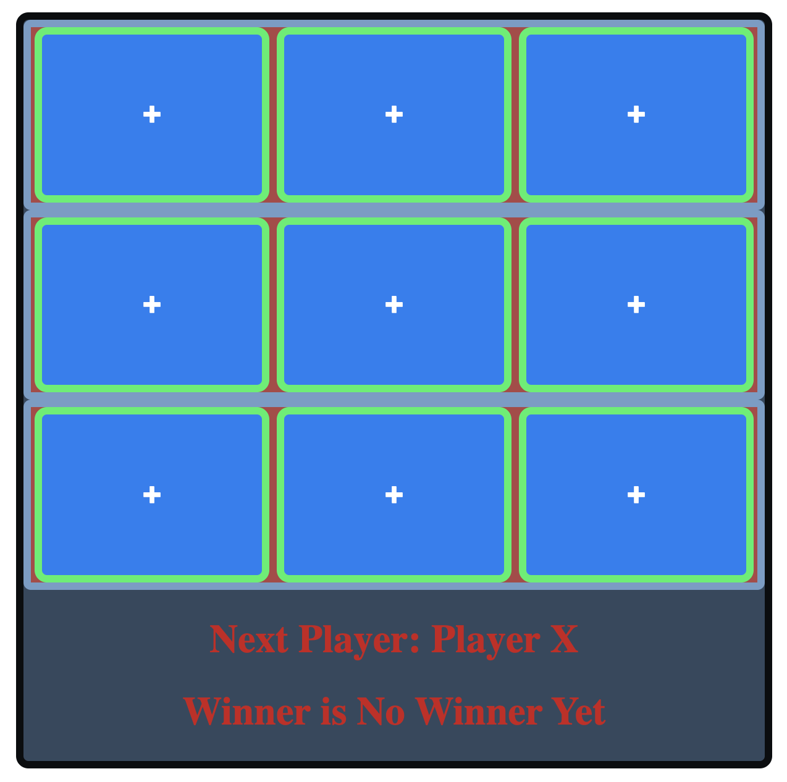

# Tic-Tac-Toe-Game ReadMe
## Tic-Tac-Toe React Project

TITLE:
Tic-Tac-Toe Game

DESCRIPTION:
A graphical game application built using react.

HOW TO RUN:
The software is hosted on github here https://github.com/cincimatti/tic-tac-toe-game
It can be reached at https://cincimatti.github.io/tic-tac-toe-game/index.html for live demonstrations.

UPDATES & ROADMAP:
UPDATES: Some additional styling (CSS) was added to the game to improve user experiance.
ROADMAPPED FEATURES: Two new features are on the roadmap for future development. 
1.) A reset button allowing the game in play to be reset before completion.
2.) A strike line that would render an html element through the winning row when it is determined by the board.

OPERATING INSTRUCTIONS:
The application is a game of tic-tac-toe. When the webapp opens a user/player clicks on a square to claim a board position. The next user is then prompted to take a turn to click on a square to claim a board position. The first user/player who gets three positions in a row (horizontal, vertical, diagonal) with their symbol wins the game. If a winner is determined it will be announced at the bottom of the board.

LICENSE INFORMATION:
Licensing information can be found in the Tic-Tac-Toe repo locate the "LICENSE" file.